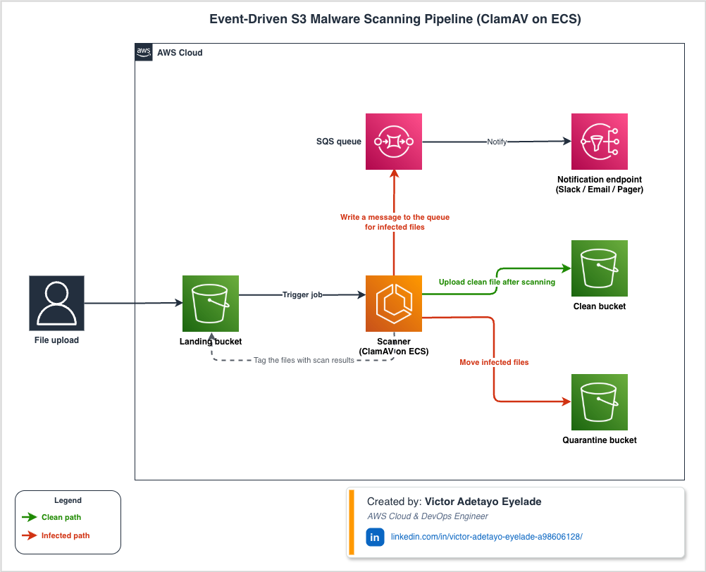
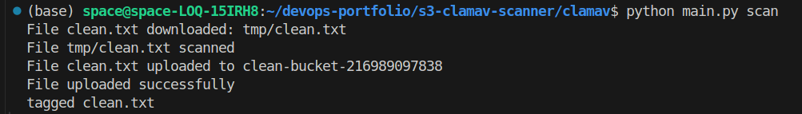
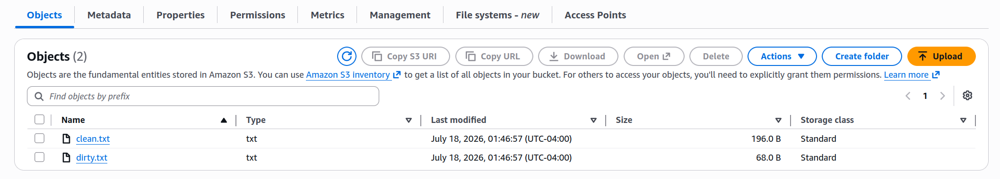
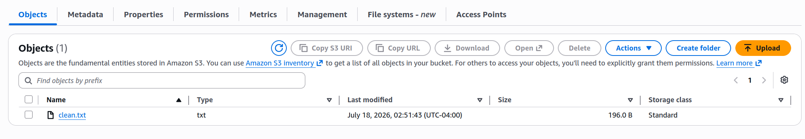
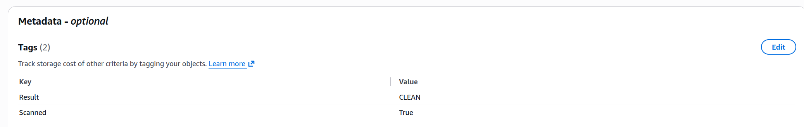
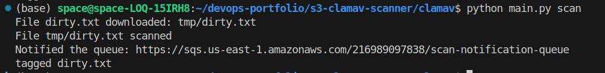
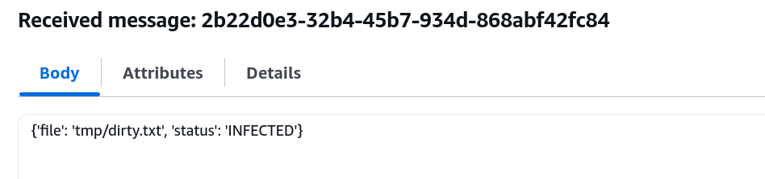
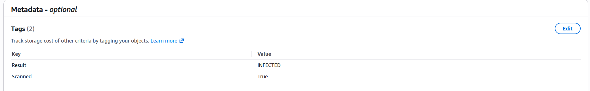
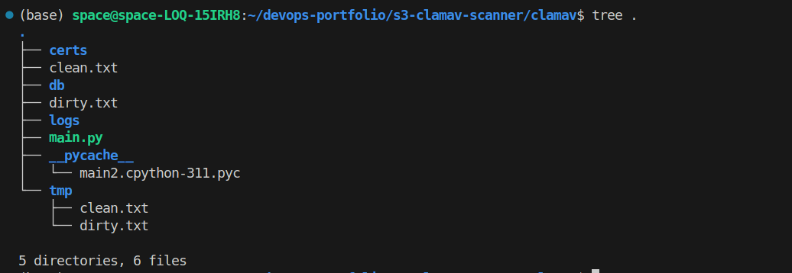

# 🛡️ Automated Amazon S3 Malware Scanner with ClamAV

> **An AWS cloud-native malware scanning pipeline that automatically inspects files uploaded to Amazon S3, routes trusted files, alerts downstream services of malicious uploads, and records scan results using Amazon S3 Object Tags.**

---

## Badges


---

# Table of Contents

- [Project Overview](#project-overview)
- [Project Highlights](#project-highlights)
- [Architecture](#architecture)
- [Key Features](#key-features)
- [Project Screenshots](#project-screenshots)
- [Technology Stack](#technology-stack)
- [Installation](#installation)
- [Configuration](#configuration)
- [AWS Authentication](#aws-authentication)
- [Required AWS Services](#required-aws-services)
- [Required IAM Permissions](#required-iam-permissions)
- [Running the Scanner](#running-the-scanner)
- [Verifying the Workflow](#verifying-the-workflow)
- [Engineering Decisions](#engineering-decisions)
- [Engineering Challenges](#engineering-challenges)
- [Security Considerations](#security-considerations)
- [Production Considerations](#production-considerations)
- [Production Roadmap](#production-roadmap)
- [Lessons Learned](#lessons-learned)
- [Skills Demonstrated](#skills-demonstrated)
- [Repository Structure](#repository-structure)
- [Getting Started](#getting-started)
- [Contributing](#contributing)
- [Author](#author)

---

# Project Overview

Modern cloud applications frequently allow users to upload documents, images, PDFs, archives, and other files into Amazon S3.

Without validating those uploads, malicious files may enter downstream systems, increasing the risk of malware propagation, compromised workloads, and unauthorized access.

This project demonstrates how to build a lightweight cloud-native malware scanning pipeline using AWS managed services and Python.

Every uploaded object is automatically:

- downloaded from Amazon S3
- scanned using ClamAV
- classified as **CLEAN**, **INFECTED**, or **ERROR**
- routed according to the scan result
- tagged with its scan status
- capable of notifying downstream applications through Amazon SQS

Unlike many demonstration projects that simply print scan results, this implementation models a production-oriented workflow by separating untrusted and trusted files, publishing asynchronous notifications, and recording scan metadata directly on the S3 object.

The project was designed with secure configuration, reusable automation, and portability in mind.

---

# Project Highlights

- Designed a secure malware-scanning workflow using Amazon S3, Amazon SQS, Python, and ClamAV.
- Implemented automated routing of clean files to a trusted S3 bucket.
- Published asynchronous malware notifications through Amazon SQS.
- Recorded scan status using Amazon S3 Object Tags for downstream consumers.
- Externalized configuration with environment variables for portability.
- Applied AWS security best practices, including least-privilege access and separation of trusted and untrusted storage.
- Designed the solution with production-oriented enhancements in mind, including event-driven processing, containerized workloads, Infrastructure as Code, and observability.


# Architecture


---

# Key Features

- 🔍 Automatically scans uploaded files using ClamAV.
- ☁️ Processes files stored in Amazon S3 landing and clean buckets.
- 📨 Publishes malware detection alerts to Amazon SQS.
- 🏷️ Records scan results using Amazon S3 Object Tags.
- ⚙️ Uses environment variables for secure and portable configuration.
- 🔄 Supports independent ClamAV virus signature updates.
- 🧪 Verified using the EICAR antivirus test file.
- 🛡️ Implements AWS security best practices including trusted/untrusted storage separation.

---

# Project Screenshots

The screenshots below demonstrate the complete malware-scanning workflow.

## Clean File Scan
The screenshot below shows the malware scanner successfully processing a clean file. The file is downloaded from the Amazon S3 landing bucket, scanned with ClamAV, identified as **CLEAN**, copied to the clean bucket, and tagged for downstream processing.

---

## Landing Bucket


## Clean Bucket

---

## Clean Object Tags



## Infected File Scan
The screenshot below demonstrates the scanner detecting an infected file using ClamAV. Instead of promoting the file to the clean bucket, the application classifies it as **INFECTED**, publishes a notification to Amazon SQS, and updates the object's tags to record the scan result.



## Amazon SQS Message



## Infected Object Tags



## ClamAV Detection
Clean file


---

# Technology Stack

| Layer | Technology |
|---------|------------|
| Language | Python 3 |
| SDK | boto3 |
| Malware Scanner | ClamAV |
| Storage | Amazon S3 |
| Messaging | Amazon SQS |
| Metadata | Amazon S3 Object Tags |
| CLI | argparse |
| Operating System | Ubuntu Linux |
| Virus Updates | freshclam |

---

# Installation

## Prerequisites

Before running the project, ensure the following are installed:

- Python 3.10+
- ClamAV
- AWS CLI
- An AWS account
- IAM user or role with appropriate permissions
- boto3
- python-dotenv

## Clone the Repository

```bash
git clone https://github.com/Evatee-coder/amazon-s3-malware-scanner.git

cd amazon-s3-malware-scanner
```

## Install Dependencies

```bash
pip install -r requirements.txt
```

## Install ClamAV

Ubuntu

sudo apt update

sudo apt install clamav clamav-daemon

python3 main.py update

# Configuration

The application loads configuration values from environment variables instead of hardcoding sensitive information.

Example:

```env
AWS_REGION=us-east-1

LANDING_BUCKET=my-landing-bucket

CLEAN_BUCKET=my-clean-bucket

QUEUE_NAME=malware-alert-queue
```

Create a `.env` file in the project root.

```bash
touch .env
```

Populate the file with your own AWS resources.

---

# AWS Authentication

The project uses the default AWS credential provider chain.

Supported authentication methods include:

- IAM User credentials
- IAM Roles
- AWS CloudShell
- Amazon EC2 Instance Profile
- AWS CLI credentials
- AWS SSO

Verify your credentials.

```bash
aws sts get-caller-identity
```

---

# Required AWS Services

The solution uses only managed AWS services.

| Service | Purpose |
|----------|---------|
| Amazon S3 | Stores uploaded files |
| Amazon S3 | Stores verified clean files |
| Amazon SQS | Publishes malware alerts |
| IAM | Access control |
| CloudWatch *(future enhancement)* | Monitoring and logging |

---

# Required IAM Permissions

The scanner requires permissions to:

- Read objects
- Copy objects
- Tag objects
- Send SQS messages
- Discover queue URLs

Example IAM policy

```json
{
  "Version":"2012-10-17",
  "Statement":[
    {
      "Effect":"Allow",
      "Action":[
        "s3:GetObject",
        "s3:PutObject",
        "s3:CopyObject",
        "s3:PutObjectTagging"
      ],
      "Resource":[
        "arn:aws:s3:::landing-bucket/*",
        "arn:aws:s3:::clean-bucket/*"
      ]
    },
    {
      "Effect":"Allow",
      "Action":[
        "sqs:GetQueueUrl",
        "sqs:SendMessage"
      ],
      "Resource":"*"
    }
  ]
}
```

# Running the Scanner

The project exposes two commands.

## Scan Files

```bash
python3 main.py scan
```

## Update Virus Definitions

```bash
python3 main.py update
```

# Verifying the Workflow

## Step 1

Upload a clean file.

```bash
aws s3 cp sample.pdf s3://landing-bucket/
```

## Step 2

Upload the EICAR antivirus test file.

```bash
aws s3 cp eicar.com s3://landing-bucket/
```

## Step 3

Verify object tags.

```bash
aws s3api get-object-tagging \
--bucket landing-bucket \
--key sample.pdf
```

## Step 4

Inspect Amazon SQS.

# Engineering Decisions

One of the primary goals of this project was to build a solution that resembles a production-ready workflow rather than a simple proof of concept.

Several design decisions were made to improve maintainability, portability, and operational simplicity.

## Environment Variables

Sensitive values such as bucket names, queue names, and AWS configuration are externalized using environment variables.

**Benefits**

- No hardcoded configuration
- Easier environment promotion
- Improved security
- Simpler deployments

## Dynamic Queue Discovery

Instead of storing an SQS Queue URL in the source code, the application dynamically retrieves it by queue name.

**Benefits**

- Works across AWS accounts
- Eliminates hardcoded URLs
- Improves portability
- Simplifies infrastructure changes

## Amazon S3 Object Tags

Object Tags were selected to store scan metadata.

Example

```
Scanned=True

Result=CLEAN
```

**Benefits**

- No external database required
- Metadata stays with the object
- Downstream services can inspect object status directly
- Lower operational complexity

## Separate Landing and Clean Buckets

The project separates uploaded files from verified files.

```
Landing Bucket
        │
        ▼
Malware Scan
        │
        ▼
Clean Bucket
```

This pattern prevents downstream applications from accessing files before they have been validated.

## Command-Line Interface

The application uses Python's `argparse` module to expose a simple interface.

```bash
python3 main.py scan

python3 main.py update
```

Advantages

- Easy automation
- Scriptable
- Cron-friendly
- CI/CD ready

# Engineering Challenges

During development, several practical challenges were encountered and resolved.

| Challenge | Solution |
|------------|----------|
| Keeping configuration portable | Externalized values into environment variables |
| Avoiding hardcoded queue URLs | Used dynamic queue discovery with `GetQueueUrl` |
| Preserving scan metadata | Implemented Amazon S3 Object Tags |
| Separating trusted files | Introduced dedicated clean bucket |
| Supporting virus updates | Added independent `update` command |
| Handling scan failures | Classified ClamAV exit codes into CLEAN, INFECTED, and ERROR |
| Verifying malware detection | Used the EICAR antivirus test file |
| Improving maintainability | Modularized the scanning workflow and centralized configuration |

---


# Security Considerations

Security was a key consideration throughout the design of this project. Although this implementation is intended as a portfolio demonstration, it follows several AWS security best practices.

## Current Security Controls

- Environment variables are used instead of hardcoded configuration.
- Malware scanning is performed before files are promoted to the trusted bucket.
- Amazon S3 Object Tags record scan status for downstream consumers.
- Dynamic Amazon SQS queue discovery avoids hardcoded queue URLs.
- Clean and untrusted files are stored in separate Amazon S3 buckets.
- Virus definitions are updated independently using `freshclam`.
- AWS authentication relies on the AWS credential provider chain.

## Security Best Practices Applied

| Practice | Status |
|----------|--------|
| Least Privilege IAM | ✅ |
| Environment Variables | ✅ |
| Separate Trusted Storage | ✅ |
| Object Metadata Tracking | ✅ |
| Queue-Based Notifications | ✅ |
| Dynamic AWS Resource Discovery | ✅ |

---

# Production Considerations

This project demonstrates the core malware-scanning workflow. In a production environment, additional AWS services and operational controls would typically be incorporated to improve scalability, resilience, and observability.

Potential enhancements include:

- Amazon EventBridge or Amazon S3 Event Notifications for event-driven scanning.
- AWS Lambda for lightweight orchestration.
- Amazon ECS Fargate for containerized scanning workloads capable of processing large files.
- Amazon CloudWatch Logs and Metrics for centralized monitoring.
- Amazon SNS or AWS Chatbot for operational notifications.
- AWS KMS for encryption of S3 objects and SQS messages.
- AWS Secrets Manager or AWS Systems Manager Parameter Store for secure configuration management.
- AWS Step Functions to coordinate complex scanning workflows.
- Dead-letter queues (DLQs) for failed message processing.
- Multi-Region deployment for disaster recovery and higher availability.

---

# Production Roadmap

The current implementation intentionally focuses on a lightweight and understandable architecture. Future iterations could extend the solution with the following capabilities.

- Provision infrastructure with Terraform
- Containerize the scanner with Docker and Amazon ECS Fargate
- Add GitHub Actions CI/CD
- Integrate CloudWatch monitoring
- Secure secrets with AWS Secrets Manager
- Encrypt resources using AWS KMS
- Implement event-driven scanning using Amazon EventBridge

# Lessons Learned

Developing this project reinforced several cloud engineering concepts beyond simply integrating AWS services.

Key takeaways include:

- Designing secure file-processing workflows.
- Managing malware scanning in cloud environments.
- Using Amazon S3 Object Tags as lightweight metadata.
- Building asynchronous workflows with Amazon SQS.
- Externalizing configuration through environment variables.
- Designing for portability across AWS accounts.
- Structuring Python applications for maintainability.
- Separating trusted and untrusted data paths.
- Applying AWS security best practices.
- Building solutions with future scalability in mind.

---

# Skills Demonstrated

This project demonstrates practical experience across multiple cloud engineering domains.

## AWS

- Amazon S3
- Amazon SQS
- IAM
- AWS CLI
- AWS SDK (boto3)

## Python

- Object-oriented programming
- argparse
- subprocess
- boto3
- Environment variables
- Exception handling
- File processing

## Security

- Malware detection
- ClamAV
- Secure configuration
- Object tagging
- Secure file routing
- Least privilege access

## Cloud Engineering

- Event-driven design concepts
- Metadata management
- Queue-based workflows
- Operational automation
- Cloud-native application design


# Repository Structure


---

# Getting Started

Clone the repository.

```bash
git clone https://github.com/Evatee-coder/amazon-s3-malware-scanner.git

cd amazon-s3-malware-scanner
```

Install dependencies.

```bash
pip install -r requirements.txt
```

Configure your environment variables.

```bash
cp .env.example .env
```

Update the ClamAV virus database.

```bash
python3 main.py update
```

Run the scanner.

```bash
python3 main.py scan
```

---

# Contributing

Contributions, suggestions, and improvements are welcome.

If you identify a bug, have an enhancement idea, or would like to extend the project, feel free to:

1. Fork the repository.
2. Create a feature branch.
3. Commit your changes.
4. Open a Pull Request.

---

# Author

## Victor Adetayo Eyelade

**AWS Cloud & DevOps Engineer**

I enjoy designing secure, scalable, and automated cloud platforms using AWS, Terraform, Kubernetes, CI/CD, and modern DevOps practices.

### Connect with me

- **GitHub:** https://github.com/Evatee-coder
- **LinkedIn:** https://www.linkedin.com/in/victor-adetayo-eyelade-a98606128/


> **Thank you for taking the time to explore this project. If you're interested in AWS, DevOps, Platform Engineering, or Cloud Security, I'd be happy to connect and discuss ideas or collaborate on future projects.**