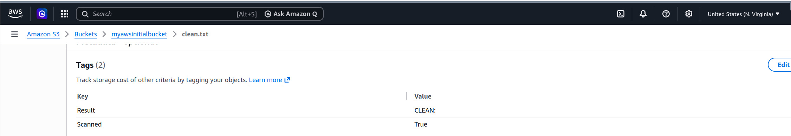
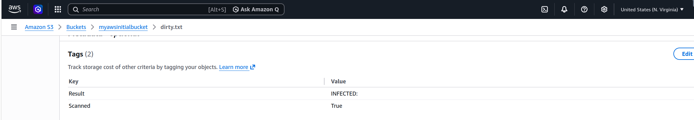

# 🛡️ Automated Amazon S3 Malware Scanner with ClamAV

<p align="center">


</p>

An automated malware scanning solution for **Amazon S3** that scans uploaded files using **ClamAV** and stores scan results directly as **S3 Object Tags**, enabling downstream applications to determine whether an object is safe without relying on an external database.

Designed as the foundation for an event-driven, cloud-native malware scanning pipeline.

---

# 📚 Table of Contents

- [Overview](#-overview)
- [Key Features](#-key-features)
- [Architecture](#-architecture)
- [Project Workflow](#-project-workflow)
- [Project Screenshots](#-project-screenshots)
- [How It Works](#-how-it-works)
- [Tech Stack](#-tech-stack)
- [Engineering Challenges](#-engineering-challenges)
- [Production Roadmap](#-production-roadmap)
- [Skills Demonstrated](#-skills-demonstrated)
- [Getting Started](#-getting-started)
- [Why This Project?](#-why-this-project)
- [Author](#-author)

---

# 📖 Overview

Malicious file uploads are a common security concern for cloud applications.

This project demonstrates how uploaded files can be automatically scanned using **ClamAV**, with the scan outcome written directly back onto the S3 object as metadata using **Amazon S3 Object Tags**.

Instead of maintaining a separate scan-results database, downstream services can simply inspect the object's tags to determine whether it has been scanned and whether it is safe for processing.

The current implementation validates the core scanning workflow:

```
Download → Scan → Tag
```

while providing the foundation for a fully event-driven, serverless malware scanning architecture.

---

# ⭐ Key Features

- Automated malware scanning with ClamAV
- Downloads files directly from Amazon S3
- Detects clean, infected, and scan error states
- Stores scan results as Amazon S3 Object Tags
- Uses the industry-standard EICAR antivirus test file
- Lightweight architecture with no external database
- Production-oriented cloud security workflow
- Designed for future event-driven deployments

---

# 🏗 Architecture

```
                    Amazon S3

                        │
                        ▼

                Download Object

                        │
                        ▼

                 ClamAV Scanner

                        │
                        ▼

              Determine Scan Result

                        │
                        ▼

             Update Amazon S3 Tags

      Scanned = True
      Result   = CLEAN | INFECTED | ERROR
```

---

# 🔄 Project Workflow

```
User Uploads File

        │

        ▼

 Amazon S3 Bucket

        │

        ▼

 Download Object

        │

        ▼

   ClamAV Scan

        │

        ▼

 Interpret Exit Code

        │

        ▼

 Update Object Tags

        │

        ▼

 Downstream Services
Validate Object Status
```

---
<!--
# 📸 Project Screenshots

## Architecture Diagram

> *(Insert architecture diagram here)*

```
docs/images/architecture.png
```
-->

---

## Clean File Scan

The image below demonstrates a successfully scanned clean file.



---

## Infected File Scan

The image below demonstrates detection of the **EICAR** antivirus test file.



---

## AWS CLI Verification

Example showing object tags retrieved directly from Amazon S3.

```
aws s3api get-object-tagging \
--bucket my-bucket \
--key sample.txt
```

Example output

```json
{
  "TagSet": [
    {
      "Key": "Scanned",
      "Value": "True"
    },
    {
      "Key": "Result",
      "Value": "CLEAN"
    }
  ]
}
```

---

# ⚙️ How It Works

1. Download the target object from Amazon S3.
2. Scan the file using ClamAV.
3. Interpret the ClamAV exit code.

| Exit Code | Meaning |
|-----------|---------|
| 0 | CLEAN |
| 1 | INFECTED |
| 2 | ERROR |

4. Update the S3 object with the scan result.

Example object tags:

| Tag | Value |
|------|-------|
| Scanned | True |
| Result | CLEAN |
| Result | INFECTED |
| Result | ERROR |

Applications can inspect these tags before allowing files to be downloaded or processed.

---

# 💻 Tech Stack

| Layer | Technology |
|--------|------------|
| Language | Python |
| AWS SDK | boto3 |
| Cloud Storage | Amazon S3 |
| Malware Detection | ClamAV |
| Metadata | Amazon S3 Object Tags |

---

# 🧩 Engineering Challenges

During development, every file—whether clean or infected—was initially tagged as **ERROR**.

The issue was traced to ClamAV's certificate validation. Recent ClamAV versions require a valid certificate directory when loading virus definitions. Without it, the scanner exits with status code **2** before processing any files.

The solution was to configure ClamAV to use a project-local certificate directory through `--cvdcertsdir`, making the scanner portable and independent of system-level configuration. Additional logging was also added to simplify troubleshooting future scan failures.

---

# 🚀 Production Roadmap

Future improvements include:

- Event-driven scanning using Amazon S3 Events
- AWS Lambda deployment
- Amazon ECS Fargate deployment
- Docker containerization
- Terraform Infrastructure as Code
- Amazon SNS notifications
- CloudWatch monitoring
- Automated ClamAV signature updates
- Dead-letter queue support
- Multi-bucket support

---

# 🛠 Skills Demonstrated

This project demonstrates practical experience with:

### Cloud

- Amazon S3
- AWS SDK (boto3)

### Security

- Malware scanning
- ClamAV
- Secure object validation

### Python

- File processing
- Error handling
- AWS automation

### Cloud Engineering

- Object metadata management
- Production workflow design
- Cloud-native architecture

---

# 🚀 Getting Started

Install dependencies

```bash
pip install boto3
sudo apt install clamav clamav-freshclam
sudo apt-get install clamav clamav-daemon
```

Update virus definitions

```bash
sudo freshclam
```

Run the scanner

```bash
python3 main.py
```

Retrieve object tags

```bash
aws s3api get-object-tagging \
--bucket <bucket-name> \
--key <object-key>
```

---

# 🎯 Why This Project?

This project demonstrates how cloud-native security workflows can be implemented without introducing unnecessary infrastructure.

Instead of persisting scan results in a database, the solution leverages **Amazon S3 Object Tags** to provide a lightweight, scalable mechanism for communicating scan status to downstream applications.

It showcases practical experience with:

- Cloud Security
- Python Automation
- Amazon S3
- AWS SDK
- Malware Detection
- Secure File Processing
- Production-oriented Design

---

# 👨‍💻 Author

**Victor Adetayo Eyelade**

AWS Cloud & DevOps Engineer

GitHub: https://github.com/Evatee-coder

LinkedIn: https://linkedin.com/in/victor-adetayo-eyelade-a98606128

---

## ⭐ If you found this project useful...

If this repository helped you or you'd like to discuss cloud security, AWS, or DevOps engineering, feel free to connect or leave a ⭐ on the repository.